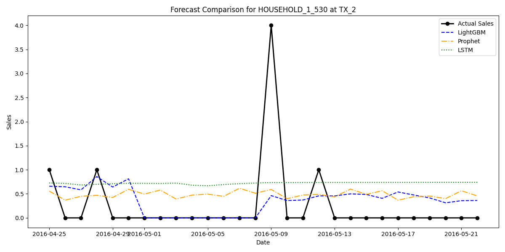

# M5 Inventory Forecasting & Demand Prediction

## Overview
This repository contains an end-to-end demand forecasting pipeline built on the **M5 Forecasting Accuracy Competition** dataset (provided by Walmart). The objective of this project is to implement, evaluate, and compare modern forecasting strategies for highly intermittent, zero-inflated retail data. 

The project replicates the core architectural methodology of the 1st Place winning submission (using LightGBM and the Tweedie objective function) and benchmarks it against classical time-series (Facebook Prophet) and deep learning (PyTorch LSTM) approaches.

## Methodology

### 1. Data Pipeline & Feature Engineering
Handling the massive M5 dataset (~60 million rows when unpivoted) requires strict memory management. 
* A disk-backed SQL database (**DuckDB**) is utilized to avoid Out-Of-Memory (OOM) failures.
* The data is unpivoted from a wide format to a long time-series format natively in SQL.
* Advanced features are generated via SQL window functions:
  * **Lags**: 1, 7, 14, and 28 days.
  * **Rolling Windows**: 7-day and 28-day moving averages and standard deviations.

### 2. Modeling Strategies
We implemented and compared three distinct methodologies:
1. **Machine Learning (LightGBM):** Following the M5 winning strategy, we trained independent gradient boosting models per store. Crucially, we utilized the `tweedie` objective function, which is mathematically designed to handle the zero-inflated demand patterns typical of retail products.
2. **Classical Time-Series (Prophet):** We trained individual Bayesian curve-fitting models per SKU/Store combination. To handle the scale, Python's `multiprocessing` library was used to parallelize the workload across CPU cores.
3. **Deep Learning (PyTorch LSTM):** We implemented a neural network with sliding sequential windows (14-day sequences) to capture long-term non-linear dependencies.

## Results & Findings

We generated forecasts for the 28-day evaluation horizon and compared the unweighted Root Mean Squared Error (RMSE) and Mean Absolute Error (MAE) across all models.

| Model | RMSE | MAE |
|---|---|---|
| **LightGBM (M5 Winner Architecture)** | **1.899** | **0.932** |
| Prophet (Classical Baseline) | 2.740 | 1.220 |
| LSTM (Deep Learning Baseline) | 2.703 | 1.224 |

### Visual Comparison
The graph below illustrates the predictive behavior of the three models on a sample intermittent SKU (`FOODS_3_689`) at a specific location (`TX_2`).

**Key Insight:** The LightGBM model utilizing the `tweedie` objective completely outperformed both the classical and modern deep learning baselines. Traditional algorithms like Prophet attempt to fit continuous curves over time, which fails on retail data where products often record 0 sales on many days. Tweedie handles data that clusters exactly at `0` efficiently, leading to a ~30% reduction in error compared to the baselines.

## Future Work
While this project captures the primary architectural drivers of the M5 winning solution, the official 1st place team utilized an ensemble of over 220 models. To further reduce the error and push the performance toward the absolute competition limit, future work could involve:
* Expanding the training loop to create sub-models per category and per department.
* Implementing recursive forecasting (where day $T+1$ uses the prediction of day $T$ as an input feature).
* Performing extensive hyperparameter tuning using Bayesian optimization frameworks like Optuna.

## Execution
To reproduce this pipeline in a cloud environment (e.g., Kaggle):
1. Import `notebooks/kaggle_payload.ipynb`.
2. Attach the `m5-forecasting-accuracy` dataset.
3. Execute the notebook to natively run the DuckDB pipeline and generate the model parquet outputs.
